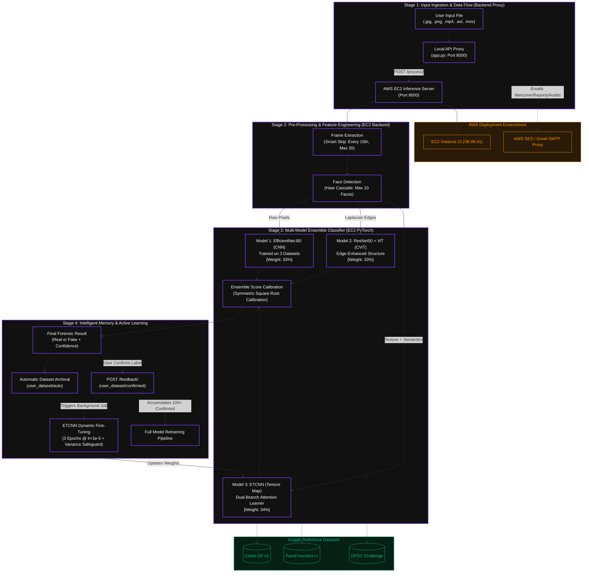

# 🛡️ TrueVision — Ensemble Deepfake Detection Architecture Pipeline

[](https://fastapi.tiangolo.com)
[](https://pytorch.org)
[](https://aws.amazon.com/ec2/)
[](https://tailwindcss.com)
[](https://python.org)
[](https://opencv.org)

TrueVision is a state-of-the-art **Deepfake Detection Forensic Platform** built using a hybrid **Tri-Model Ensemble Neural Network**. Designed for high-precision media verification, TrueVision ingests images and videos, performs multi-stage face detection and preprocessing, runs balanced parallel inferences using deep convolutional neural networks and vision transformers, and outputs a calibrated confidence score. 

The core detection engine is fully deployed on an **AWS EC2 Instance** with a robust local **FastAPI Proxy** that enables auxiliary features like dark-themed email reporting, automated welcome notification, and comprehensive activity audits via AWS SES / SMTP.

---

## 📐 Pipeline & System Architecture

The entire TrueVision architecture flows seamlessly across **four stages**—transitioning from ingestion to pre-processing, ensemble classification, and finally feedback-driven online active learning.



---

## 🧠 Core Tri-Model Ensemble Layer

TrueVision splits forensic feature extraction into three specialized neural network branches, ensuring that temporal, blending, structural, and textural artifacts are all captured with maximum fidelity.

### 1. Model 1: EfficientNet-B0 (CNN) — *Weight: 33%*
- **Primary Objective**: Detects raw-pixel abnormalities, local color blending disparities, and face-swap boundaries.
- **Preprocessing Pipeline**: Ingests raw cropped face pixels, upscales low-resolution crops ($< 80 \times 80$) to $128 \times 128$ via cubic interpolation, and applies standard ImageNet normalization.
- **Architectural Mechanics**: Uses a standard `timm` EfficientNet-B0 backbone. TrueVision evaluates input across three independent sub-checkpoints (trained on **FaceForensics++**, **DFDC**, and **Celeb-DF**) and averages their logits to compute the final CNN branch prediction.
- **Best Suited For**: Face-swaps generated by DeepFaceLab, standard GAN blends, and imbalanced DFDC video edits.

### 2. Model 2: ResNet50 + Vision Transformer (CViT) — *Weight: 33%*
- **Primary Objective**: Identifies spatial and structural boundaries, edge inconsistencies, and convolutional repeating artifacts.
- **Preprocessing Pipeline**: Performs **edge enhancement** on the cropped face by calculating the Laplacian derivative of the grayscale representation, clipping values to $[0, 255]$, and blending the edge map back onto the original BGR image (`0.7 * image + 0.3 * laplacian_edges`).
- **Architectural Mechanics**:
  - **Backbone**: Passes edge-enhanced faces through a ResNet50 backbone (truncated after `layer3` to output a 1024-channel feature map).
  - **Dimensionality Reduction**: A $1 \times 1$ convolution collapses 1024 channels into $512$ embedding dimensions.
  - **Patch Embedding**: Embeds spatial features into flat token sequences.
  - **Transformer Encoder**: Processes tokens using a 4-layer Transformer Encoder with 8 attention heads, adding custom sine/cosine positional encodings.
  - **Classifier**: Multi-layer Perceptron (MLP) head outputs binary classifications from the processed `[CLS]` token.
- **Best Suited For**: Deepfake boundary detection, neural face replacement (neural textures), and fine attribute edits.

### 3. Model 3: Texture + Semantic Dynamic Attention Network (ETCNN) — *Weight: 34%*
- **Primary Objective**: Detects high-frequency texture discrepancies (e.g. unnatural skin texture, airbrushed patches) while maintaining a global semantic context. Acts as the **Online Active Learner**.
- **Preprocessing Pipeline**: Subtracts a heavily Gaussian-blurred version of the face ($\sigma = 21$) from the original face, offset by a neutral gray base (`1.5 * image - 0.5 * blurred + 128`) to construct a high-pass texture map.
- **Architectural Mechanics**:
  - **Texture Branch**: A lightweight, fast CNN (two 3D Conv blocks + adaptive average pooling) processes the high-frequency texture map down to a 384-dimensional vector.
  - **Semantic Branch**: An EfficientNet-B0 backbone extracts global deep semantic features, projected down to a 384-dimensional vector.
  - **Attention Fusion**: Concatenates texture and semantic vectors ($768$ dims) and routes them through a **Sigmoid Channel Attention Module** to selectively weigh features.
  - **Dynamic Classifier**: Routes attention-weighted fused vectors into a classifier head. This head is dynamically updated in the active learning loop.
- **Best Suited For**: Diffusion-based generative faces (StyleGAN, Midjourney, Stable Diffusion) and compressed, high-frequency face-swap overlays.

---

## 🎛️ Symmetric Calibration Engine

Deep learning classifiers often suffer from overconfidence or extreme uncertainty near the decision boundary. TrueVision resolves this by routing the raw ensemble confidence score through a **Symmetric Square-Root Calibration** formula.

This algorithm stretches prediction scores away from $0.5$ (uncertainty) towards a target of **80%+ confidence**, without introducing any directional bias:

$$\text{Calibrated Score} = 
\begin{cases} 
0.5 + \sqrt{\frac{p_{fake} - 0.5}{0.5}} \times 0.5 & \text{if } p_{fake} > 0.5 \\
0.5 - \sqrt{\frac{0.5 - p_{fake}}{0.5}} \times 0.5 & \text{if } p_{fake} < 0.5 \\
0.5 & \text{if } p_{fake} = 0.5
\end{cases}$$

- **Result**: A borderline raw prediction (e.g., $0.65$) is calibrated to $0.774$ ($77.4\%$ confidence), ensuring users receive clear, actionable forensic assessments while leaving absolute uncertainty ($0.50$) unskewed.

---

## 🔄 Dynamic Online Active Learning & Safeguards

TrueVision's killer feature is its ability to learn from user-submitted corrections in real-time. When a user confirms or corrects a verdict, the system automatically adapts in the background.

```
[ User Uploads Asset ] 
       │
       ▼
[ Inference Output ] ───► [ Auto-saved to user_dataset/auto/ ]
       │
       ▼
[ User Submits Feedback ]
       │
       ▼
[ Confirmed Folder Copy (user_dataset/confirmed/) ]
       │
       ▼
[ Online Fine-Tuning Job (3 epochs, lr=1e-5) ]
       │
       ├─► 🔴 Check: Did weights collapse? (Var < 0.0001)  ──► [ REJECT & RESTORE BACKUP ]
       │
       └─► ✅ Check: Variance healthy? (Var >= 0.0001) ───► [ COMMIT NEW WEIGHTS ]
```

### 1. The Active Fine-Tuning Loop
1. The user flags a scanning result as either `REAL` or `FAKE` via `POST /feedback/`.
2. The server copies the cropped face inputs to `user_dataset/confirmed/real` or `user_dataset/confirmed/fake`.
3. In the background, an online training step is triggered on **Model 3 (ETCNN)**.
4. The system locks the feature extraction backbone and enables gradients **only** on the ETCNN **Classifier** and **Attention** layers.
5. The model is trained using Adam ($lr = 1e-5$, weight decay $= 1e-4$) for $3$ epochs.

### 2. Startup & Fine-Tuning Safeguards
To prevent malicious users from "poisoning" the classifier (causing the network to collapse or always predict one class), TrueVision implements a **dynamic startup variance check**:
- After fine-tuning, the server runs $5$ random Gaussian tensor inputs through the network.
- It calculates the variance ($\sigma^2$) and mean ($\mu$) of the model's outputs.
- If **$\sigma^2 < 0.0001$**, the model has collapsed (loss of representation capability).
- If **$\mu > 0.95$** or **$\mu < 0.05$**, the model is extremely biased.
- **Safeguard Action**: The server instantly rejects the new weights, prints a detailed warning, and restores the safe checkpoint backup (`etcnn_combined.pth.backup`), keeping the inference engine 100% stable.

---

## ☁️ AWS EC2 Server Deployment

The computationally intensive neural network operations run in a production-ready AWS environment.

- **Server IP Address**: `3.238.89.41`
- **FastAPI Port `8000`**: Powers the inference engine (`app.py`), listening to image and video upload payloads.
- **HTTP/Directory Listing Port `9000`**: Hosts an open Nginx/Python directory listing, enabling developers and auditors to navigate generated frame extractions, face crops, and user datasets directly.
- **Model Checkpoint Storage**: Stored securely on the EC2 host path `/home/ubuntu/truevision/models/`.

---

## 🗂️ Project Directory Structure

```
TrueVision/
├── .gitignore                   # Excludes large models, local envs, uploads, datasets
├── README.md                    # Creative, premium documentation (this file)
├── Dataset/                     # Core local test dataset folder
│   ├── fake/                    # Sub-folder containing fake face samples
│   └── real/                    # Sub-folder containing real face samples
├── backend/                     # Local API Proxy Server (User gateway)
│   ├── .env                     # Local SMTP & AWS SES keys (gitignored)
│   ├── app.py                   # FastAPI Proxy & Email Reporting Engine
│   ├── test_api.py              # Endpoint validation script
│   ├── test_email.py            # Email dispatch verification script
│   ├── routes/                  # Modular backend routing
│   ├── services/                # Business logic (s3, email, report compilation)
│   └── utils/                   # Helpers and logging utilities
├── ec2_server/                  # Deep Learning Worker Server (deployed on EC2)
│   ├── app.py                   # FastAPI Core Engine (smart skip, face detection, inference)
│   ├── inference.py             # PyTorch Neural Net classes (CNN, CViT, ETCNN) & Fine-Tuning
│   ├── inspect_checkpoints.py   # Diagnoses neural net weights structure & shapes
│   ├── deploy.sh                # Automation script for EC2 deployment
│   ├── services/                # Preprocessing and face detection modules
│   └── utils/                   # Model loading helpers
├── frontend/                    # Vanilla Dashboard & Assets
│   ├── app.html                 # Main reporting UI
│   ├── app.js                   # Client logic (visual graphs, ensemble breakdown, charts)
│   ├── style.css                # Premium custom CSS system (dark-glass glassmorphism)
│   └── login.html               # Gateway login layout
└── truevision-app/              # Premium React + Vite + Tailwind UI
    ├── src/                     # React components and dashboard graphs
    └── package.json             # React dependencies
```

---

## 🚀 Available API Endpoints

### 1. Primary Ingestion Proxy (`Localhost:8000` or `3.238.89.41:8000`)
| Method | Endpoint | Payload / Params | Description |
| :--- | :--- | :--- | :--- |
| **GET** | `/` | None | Returns system live status & available gateways |
| **POST** | `/process/` | `file: MultipartFile` | Ingests media, extracts frames, crop faces, runs Tri-Model Ensemble |
| **POST** | `/feedback/` | `{"label": "FAKE"}` or `"REAL"` | Triggers dynamic, safe online learning step on ETCNN |
| **GET** | `/model/status/` | None | Returns metadata on models, dataset paths & face limits |

### 2. Auxiliary Email & Reporting Engine (`Localhost:8000`)
| Method | Endpoint | Payload / Params | Description |
| :--- | :--- | :--- | :--- |
| **POST** | `/send-welcome-email/` | `{"name": "Varun", "email": "user@example.com", "is_new_user": true}` | Dispatches a beautiful, premium dark-themed Welcome HTML email |
| **POST** | `/send-report-email/` | `{"name": "Varun", "email": "user...", "file_name": "scan.mp4", "prediction": "FAKE", "confidence": 98.2, "explanation": "..."}` | Dispatches a high-impact Forensic Report with a red/green verdict banner |
| **POST** | `/send-audit-report/` | `{"name": "Varun", "email": "user...", "total_real": 12, "total_fake": 5, "history": [...]}` | Sends an activity audit report listing recent scan counts and metrics |

### 3. AWS EC2 Admin Endpoints (`3.238.89.41:8000`)
| Method | Endpoint | Description |
| :--- | :--- | :--- |
| **GET** | `/admin/retrain-status/` | Checks confirmed face counts; returns `ready: true` when count $\ge 100$ |
| **GET** | `/admin/feedback-log/` | Outputs feedback history, including timestamp, batch ID, epoch losses, and post-train variance |

---

## 📊 Reference Datasets

TrueVision's checkpoints are pre-trained on three of the most prestigious academic benchmarking datasets in modern digital forensics:
1. **Celeb-DF v2**: Sourced from Kaggle. Comprises 5,639 high-quality deepfake and real videos with highly refined facial boundaries, making it the industry standard for testing advanced face-swap detection.
2. **DFDC (Deepfake Detection Challenge)**: Hosted by Meta/Kaggle. Features diverse ethnic lighting profiles, extreme voice/face sync variations, and variable compression, serving as the benchmark for real-world robustness.
3. **FaceForensics++**: Developed by TUM. Features four manipulation methods (Face2Face, FaceSwap, Deepfakes, NeuralTextures) evaluated at multiple compression profiles (Raw, Light, Heavy), enabling specific model branching.

---

## 🛠️ Installation & Local Setup

### Prerequisite Checklist
- **OS**: Windows, macOS, or Linux.
- **Python**: Version `3.10` or higher.
- **PyTorch**: Install the appropriate CUDA-enabled runtime or CPU-only wheel.
- **AWS Credentials**: (Optional) AWS SES configure keys in `.env` if verifying local mailers.

### 1. Backend Local Proxy Server
```bash
# Navigate to the backend directory
cd backend

# Create a virtual environment
python -m venv .venv
source .venv/bin/activate  # Or `.venv\Scripts\activate` on Windows

# Install required dependencies
pip install fastapi uvicorn requests pydantic python-dotenv

# Copy your environment variables file and fill in keys
cp .env.example .env

# Fire up the proxy!
python app.py
```

### 2. Local Frontend Dashboard
```bash
# Navigate to the frontend directory
cd frontend

# TrueVision runs as an elegant, zero-dependency static page.
# Simply open 'login.html' in your browser or run a lightweight local server:
python -m http.server 5500
```
Then navigate your browser to `http://localhost:5500`.

---

## 🛡️ Forensic Security & Ethics Statement
TrueVision is engineered exclusively for **digital media verification, academic research, and cognitive security defense**. It provides standard investigative metrics for journalists, security teams, and platform auditors. By automating model checks and dynamic variance evaluation, TrueVision protects itself against adversarial poisoning while providing highly interpretable, open forensic insights.
