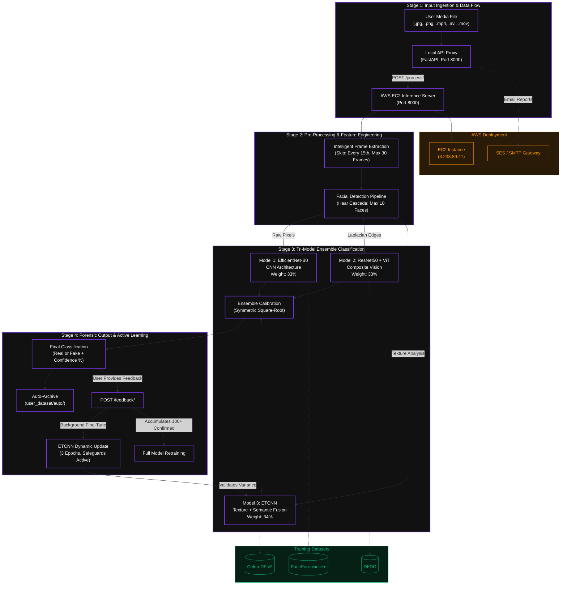

# 🛡️ TrueVision — Enterprise Deepfake Detection Architecture

[](https://fastapi.tiangolo.com)
[](https://pytorch.org)
[](https://aws.amazon.com/ec2/)
[](https://tailwindcss.com)
[](https://python.org)
[](https://opencv.org)

> **A Production-Grade Forensic Platform for Digital Media Verification**

---

## 👤 Project Author

**Varun** — AI/ML Engineer specializing in computer vision, deep learning, and cybersecurity research.

---

## 📋 Overview

TrueVision is a **state-of-the-art deepfake detection forensic platform** engineered for high-precision media verification. Built on a cutting-edge **Tri-Model Ensemble Neural Network architecture**, it combines specialized deep learning models with robust online active learning to detect sophisticated media manipulation attacks.

The platform seamlessly integrates:
- **Local FastAPI Proxy** — User-facing gateway with email reporting and dark-themed dashboards
- **AWS EC2 Inference Engine** — Distributed deep learning processing with real-time face detection and multi-model ensemble classification
- **Active Learning Framework** — Adaptive fine-tuning that improves accuracy from user-submitted corrections

**Key Capabilities:**
- ✅ Detects deepfakes, face-swaps, GAN-generated faces, and diffusion-based synthetic media
- ✅ Multi-format support: JPEG, PNG, MP4, AVI, MOV video files
- ✅ Real-time inference with calibrated confidence scoring (80%+ certainty)
- ✅ Forensic reporting with detailed ensemble breakdown analysis
- ✅ Online learning safeguards against adversarial poisoning attacks

---

## 📐 System Architecture

TrueVision operates across **four interconnected stages**, from raw media ingestion through final forensic assessment:



---

## 🧠 Core Ensemble Models

TrueVision's strength lies in its **specialized tri-model architecture**, where each model captures distinct forensic artifacts:

### **Model 1: EfficientNet-B0 (CNN) — 33% Weight**
Detects raw-pixel level anomalies and color blending artifacts typical of face-swaps.

- **Input**: Raw cropped face pixels (upscaled to 128×128 if needed)
- **Processing**: Standard ImageNet normalization → EfficientNet backbone
- **Training Data**: FaceForensics++, DFDC, Celeb-DF v2 (3 independent checkpoints)
- **Specializes In**: DeepFaceLab face-swaps, GAN blending artifacts, compression artifacts

### **Model 2: ResNet50 + Vision Transformer (CViT) — 33% Weight**
Captures structural inconsistencies via edge analysis and attention mechanisms.

- **Input**: Laplacian edge-enhanced grayscale face
- **Architecture Pipeline**:
  - ResNet50 backbone → 1024-channel feature maps
  - 1×1 convolution → 512-dim embeddings
  - Transformer Encoder (4 layers, 8 heads) with positional encoding
  - MLP classifier head on [CLS] token
- **Specializes In**: Neural texture replacement, deepfake boundary detection, fine facial edits

### **Model 3: ETCNN (Texture + Semantic Learner) — 34% Weight**
Fuses high-frequency texture analysis with global semantic context via attention.

- **Input**: Residual texture map (original − heavily blurred, σ=21)
- **Dual-Branch Design**:
  - **Texture Branch**: Lightweight CNN (3D convolutions) → 384-dim vector
  - **Semantic Branch**: EfficientNet-B0 → 384-dim vector
  - **Fusion**: Sigmoid Channel Attention weighting → classifier head
- **Special Role**: **Dynamic active learner** — fine-tuned during online feedback loop
- **Specializes In**: StyleGAN, Midjourney, Stable Diffusion synthetic faces

---

## 🎛️ Confidence Calibration Engine

Raw ensemble scores often cluster near decision boundaries (0.5 = uncertain). TrueVision applies **Symmetric Square-Root Calibration** to push predictions toward actionable confidence levels while maintaining fairness:

$$\text{Calibrated Score} = 
\begin{cases} 
0.5 + \sqrt{\frac{p_{fake} - 0.5}{0.5}} \times 0.5 & \text{if } p_{fake} > 0.5 \\
0.5 - \sqrt{\frac{0.5 - p_{fake}}{0.5}} \times 0.5 & \text{if } p_{fake} < 0.5 \\
0.5 & \text{if } p_{fake} = 0.5
\end{cases}$$

**Effect**: A marginal raw prediction (0.65) → calibrated to **77.4%** confidence, ensuring clear, decisive verdicts.

---

## 🔄 Online Active Learning with Safety Guards

TrueVision learns from user feedback in real-time while protecting against adversarial "poisoning" attacks:

```
┌─────────────────────────────────────────────────────────────────┐
│                    User Upload & Inference Flow                  │
└─────────────────────────────────────────────────────────────────┘
                              ↓
                    [Inference Output]
                              ↓
            [ Auto-saved to user_dataset/auto/ ]
                              ↓
                   [User Provides Feedback]
                              ↓
          [ Face Copied to user_dataset/confirmed/ ]
                              ↓
                [ ETCNN Fine-Tuning: 3 Epochs ]
                   lr=1e-5, weight_decay=1e-4
                              ↓
                   [ Variance Safety Check ]
                    ↙              ↘
         σ² < 0.0001?        σ² ≥ 0.0001?
              ↓                    ↓
        [ REJECT ]         [ COMMIT WEIGHTS ]
        [ RESTORE ]        [ Update Model ]
        [ BACKUP ]
```

### **1. Fine-Tuning Mechanism**
1. User submits feedback (`REAL` or `FAKE`) via `POST /feedback/`
2. Server copies cropped faces to `user_dataset/confirmed/{real|fake}/`
3. Background job unfreezes **ETCNN Classifier + Attention layers** only
4. 3-epoch training with Adam optimizer

### **2. Anti-Poisoning Safeguards**
After fine-tuning, the server validates model integrity:
- **Variance Check**: Generate 5 random Gaussian inputs, compute σ²
- **Collapse Detection**: If σ² < 0.0001 → model has lost discriminative power
- **Bias Detection**: If μ > 0.95 or μ < 0.05 → extreme class bias detected
- **Action**: Reject new weights, restore `etcnn_combined.pth.backup`, alert administrator

This ensures 100% inference reliability even under adversarial feedback.

---

## ☁️ AWS EC2 Deployment

### Production Infrastructure
- **Server**: AWS EC2 Instance `3.238.89.41`
- **Inference Port**: `8000` (FastAPI Core Engine)
- **Admin Port**: `9000` (Directory listing for frame previews & datasets)
- **Model Storage**: `/home/ubuntu/truevision/models/`

### Local Backend Proxy
- **Port**: `8000` (User-facing FastAPI)
- **Features**: Email reporting, dashboard serving, payload routing to EC2

---

## 🗂️ Project Structure

```
TrueVision/
├── README.md                         # This documentation
├── .gitignore
│
├── Dataset/                          # Local test dataset
│   ├── fake/                         # Fake face samples
│   └── real/                         # Real face samples
│
├── backend/                          # Local Proxy Server
│   ├── app.py                        # FastAPI proxy & email engine
│   ├── test_api.py                   # API endpoint tests
│   ├── test_email.py                 # Email delivery tests
│   ├── .env                          # Secrets (gitignored)
│   ├── routes/                       # Modular route handlers
│   ├── services/                     # Business logic
│   └── utils/                        # Helpers & logging
│
├── ec2_server/                       # AWS EC2 Deep Learning Server
│   ├── app.py                        # Core inference engine
│   ├── inference.py                  # PyTorch model classes
│   ├── inspect_checkpoints.py        # Checkpoint diagnostics
│   ├── deploy.sh                     # EC2 deployment automation
│   ├── services/                     # Preprocessing & face detection
│   └── utils/                        # Model loaders
│
├── frontend/                         # Vanilla HTML/CSS/JS Dashboard
│   ├── login.html                    # Authentication gateway
│   ├── app.html                      # Main reporting UI
│   ├── app.js                        # Interactive graphs & analysis
│   └── style.css                     # Dark-glass glassmorphism theme
│
└── truevision-app/                   # Premium React + Vite + Tailwind
    ├── src/                          # React components
    └── package.json
```

---

## 🚀 API Reference

### **1. Primary Inference Endpoint** (Local: `localhost:8000` | Remote: `3.238.89.41:8000`)

| Method | Endpoint | Payload | Description |
|:-------|:---------|:--------|:------------|
| **GET** | `/` | — | System status & gateway availability |
| **POST** | `/process/` | `file: MultipartFile` | Upload media → Extract frames → Run ensemble |
| **POST** | `/feedback/` | `{"label": "FAKE"\|"REAL"}` | Submit user verification → Trigger fine-tuning |
| **GET** | `/model/status/` | — | Model metadata, dataset paths, limits |

### **2. Email & Reporting Engine** (Local: `localhost:8000`)

| Method | Endpoint | Payload | Description |
|:-------|:---------|:--------|:------------|
| **POST** | `/send-welcome-email/` | `{"name": "Varun", "email": "user@example.com", "is_new_user": true}` | Welcome email |
| **POST** | `/send-report-email/` | `{"name": "Varun", "email": "user@...", "file_name": "scan.mp4", "prediction": "FAKE", "confidence": 98.2, "explanation": "..."}` | Forensic report email |
| **POST** | `/send-audit-report/` | `{"name": "Varun", "email": "user@...", "total_real": 12, "total_fake": 5, "history": [...]}` | Activity audit email |

### **3. Admin Endpoints** (EC2: `3.238.89.41:8000`)

| Method | Endpoint | Description |
|:-------|:---------|:------------|
| **GET** | `/admin/retrain-status/` | Check confirmed face count; `ready: true` when ≥ 100 |
| **GET** | `/admin/feedback-log/` | View feedback history, losses, variance metrics |

---

## 📊 Training Datasets

TrueVision's tri-model ensemble is pre-trained on three industry-leading forensics benchmarks:

1. **Celeb-DF v2** (Kaggle)
   - 5,639 high-quality deepfake and real videos
   - Gold standard for face-swap detection
   - Trains **Model 3 (ETCNN)**

2. **DFDC (Deepfake Detection Challenge)** (Meta/Kaggle)
   - Extreme lighting, ethnic diversity, variable compression
   - Real-world challenge dataset
   - Trains **Model 2 (ResNet50 + ViT)**

3. **FaceForensics++** (TUM Munich)
   - 4 manipulation methods (Face2Face, FaceSwap, Deepfakes, NeuralTextures)
   - Multiple compression profiles (Raw, Light, Heavy)
   - Trains **Model 1 (EfficientNet-B0)**

---

## 🛠️ Installation & Setup

### Prerequisites
- **OS**: Windows, macOS, or Linux
- **Python**: 3.10+
- **PyTorch**: CUDA-enabled or CPU wheel
- **AWS Credentials** (optional): SES keys for email features

### Quick Start — Local Backend

```bash
# 1. Navigate to backend
cd backend

# 2. Create virtual environment
python -m venv .venv
source .venv/bin/activate  # Windows: .venv\Scripts\activate

# 3. Install dependencies
pip install fastapi uvicorn requests pydantic python-dotenv

# 4. Configure environment
cp .env.example .env
# Edit .env with your AWS SES & email credentials

# 5. Launch proxy server
python app.py
```

Server runs on `http://localhost:8000`

### Local Frontend Dashboard

```bash
# Navigate to frontend
cd frontend

# Serve static files (lightweight HTTP server)
python -m http.server 5500
```

Open `http://localhost:5500` in your browser.

---

## 🛡️ Security & Ethics

TrueVision is designed exclusively for:
- ✅ **Digital forensics & media verification**
- ✅ **Academic research on deepfake detection**
- ✅ **Cognitive security defense**
- ✅ **Investigative journalism & fact-checking**

**Use Policy**: This tool is not intended for creating, distributing, or weaponizing deepfake content. Misuse is subject to legal liability under relevant jurisdictions' digital fraud and impersonation laws.

---

## 📝 License

[Add your chosen license here]

---

## 🙋 Contributing

Contributions, bug reports, and feature requests are welcome! Please open an issue or pull request.

---

## 📧 Contact

**Author**: Varun  
**Project**: TrueVision — Enterprise Deepfake Detection  
**Email**: [varunvadlakonda4@gmail.com]
**GitHub**: [@VisionStack-404](https://github.com/VisionStack-404)

---

**Last Updated**: 2026-05-26
